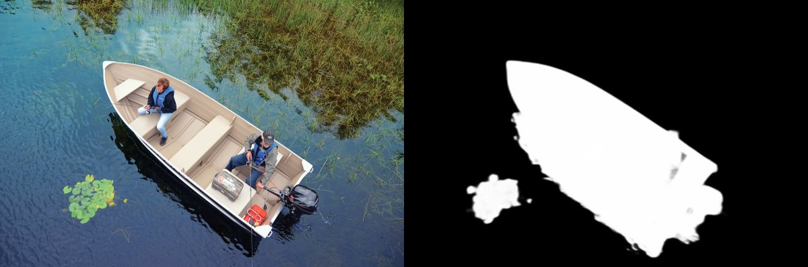

## ffmask - detect foreground object or human face from images and videos

This is a Python project based on  [U²-Net](https://github.com/xuebinqin/U-2-Net "u2net") and [Face Recognition](https://github.com/ageitgey/face_recognition "Face Recognition"):

- Use u2net used to detect foreground objects. The default u2net model, the small and fast version (u2netp), and human segmentation version are supported.
- Use face recognition to detect face outline.
- Can process both image and videos.
- Run on either CPU or GPU (using ONNX runtime).

A mask is generated for input image or each video frame. No further processing of the mask is done. The intention is to use the mask in image or video editors for further processing.

Face detection mode (the "-m face" or "--model face" option):

## Installation

- Python version 3.9 or later. Create a virtual environment if you want to.
- Install ONNX runtime for your system.
- Clone this repository.
- Run "pip install -r requirements.txt".
- Download the model files from https://huggingface.co/by321/ffmask/tree/main and save to pretrained_models directory:

	- haarcascade_frontalface_alt2.xml, for Haar Cascasde face detection
	- haarcascade_frontalface_default.xml, for Haar Cascade face detection
	- u2net.pth.onnx, the main u2net model file
	- u2netp.pth.onnx, the small and fast version
	- u2net_human_seg.pth.onnx, specially trained version to detect humans
- If you see an error message about missing openh264-*.dll, download the appropriate DLL from https://github.com/cisco/openh264 and put it somewhere on your path.
- If you want to run conv_u2net_to_onnx.py, you need to install PyTorch.
## Usage

Run "python ffmask.py" will print an overview of the usage:

	Usage: ffmask.py [OPTIONS] COMMAND [ARGS]...

	Extract mask of foreground object or face in image or video

	Options:
	--version  Show the version and exit.
	--help     Show this message and exit.

	Commands:
	image   Process an input image and save to output image
	listep  List installed ONNX execution providers.
	video   Process an input video and save to output video in MP4 format.

Run "python ffmask.py image --help" or "python ffmask.py video --help" will show further usage text.

Usage examples:

    python ffmask.py image input.jpg mask.jpg

    python ffmask.py video input.mp4 mask.mp4

## Creating and Quantizing ONNX model files

The ONNX models files were converted from original PyTorch files using conv_u2net_to_onnx.py. You can also use conv_u2net_to_onnx.py to truncate ONNX files for smaller model size and faster execution time.
Run "python conv_u2net_to_onnx.py --help" for usage info.

